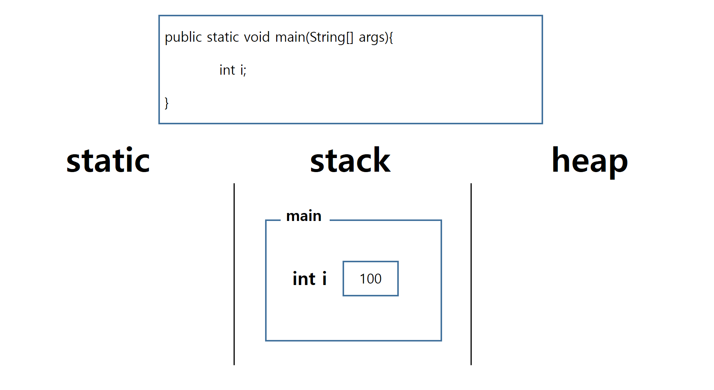

Java 기본 문법																																					2019.12.06

---

> 은행 ATM기의 프로그램을 만들어 보자. 


필요한 항목을 생각해보면 **계좌번호, 예금주, 잔액, 거래내용** 등이 있을 것이다

```java
class 계좌{
    계좌번호
    예금주
    잔액
}
```

이러한 항목을 **멤버 변수**  또는 **멤버 필드** 라고 부른다.


또 ATM의 기능을 생각해보면 **출금하기, 입금하기, 거래내역 조회** 등이 있다.


```java
출금하기 (카드번호, 비밀번호, 금액){
    1. 기능선택
    2. 비밀번호 입력 후 체크
    3. 출금할 금액 입력
    4. 출금하기
}
```

이러한 기능을 함수화한 것을 **멤버 메소드**라고 한다.


# 1. Application의 정의

---

> java interpreter 내에 start point가 **public static void main(String[] args){}**를 찾아서 코드 내의 첫줄을 실행

* 기본형식

  ```java
  public class className{
      public static void main(String[] args){
          ...
      }
  }
  ```

  main 내에서 실행할 작업 코드를 작성


# 2. 상수와 리터럴

> 원래 1, 123, 3.14, 'A'와 같은 값들이 '상수'인데, 프로그래밍에서는 상수를 '값을 한 번 저장하면 변경할 수 없는 저장공간'으로 정의하였기 때문에 이와 구분하기 위해 기존의 상수의 의미를 '리터럴' 이라는 이름으로 부르기로 했다.


* 변수(variable) : 하나의 값을 저장하기 위한 공간
* 상수(constant) : 값을 한번만 저장할 수 있는 공간
* 리터럴(literal) : 그 자체로 값을 의미하는 것


# 3. 변수

* 변수 선언

  [Data Type] [value name] = 초기화 작업


* 기본형 (괄호 안 숫자는 byte 단위의 메모리크기)

  * 문자

    : char(2)

    

  * 숫자

    * 정수

      : byte(1), short(2), int(4), long(8)

      

    * 실수

      : float(4), double(8)

      

  * 불 대수 (true/false)

    : boolean(1)

    default 는 false

    

    

    |        | 1 byte  | 2 byte | 4 byte | 8 byte |
    | ------ | ------- | ------ | ------ | ------ |
    | 논리형 | boolean |        |        |        |
    | 문자형 |         | char   |        |        |
    | 정수형 | byte    | short  | int    | long   |
    | 실수형 |         |        | float  | double |

    

* 참조형

  : API에 포함된 class를 메모리에 올릴때,

   내가 만든 class를 사용할때,

   배열을 사용할때

   참조형을 사용


* 형변환

  * 자동형변환

    byte → short → int, char → long → float → double

    

  * 명시적 형변환

    괄호 안에 data_type을 써서 형변환

    ex)

    ```java
    double i = (double)1;
    ```

    

  


> 예제

```java
double a = 10/3;

*result----------------
3.0
```

= 일때, 리터럴(오른쪽) 먼저 계산

리터럴의 기본 data type은 int


① 10/3 = 3 (int)

② int (3) → double (3.0)


# +. JVM 메모리 영역

* static

  : static 변수들과 클래스 데이터가 올라가는 공간. 초기에 한번만 올라감.

  

* stack

  : main 내의 변수와 함수들이 올라가는 공간.

    현재 내가 필요한 값들 올림.

    

* heap

  :  객체가 올라가는 공간.

     사용하고 싶은 api 클래스 데이터를 올림.

   




# 4. 연산자


* 산술연산자

  **-, +, *, /, %,<<,>>**

  

* 비교 연산자

  **\>, <,  >=, <=, ==, != **

  
  
  +) 문자열의 비교
  
  equals() : true, false
  
  
  
* 논리 연산자

  **&&, ||, !, &, |, ^, ~**


* 대입 연산자

  **=**

  

* 기타 

  **(type)(형변환 연산자), ? : (3항 연산자), instanceof**


# 5. 제어 구문

### 1) 순차형


### 2) 선택형

* if
* switch


### 3) 순환형

* for
* while
* do ~ while


# 6. Class

서점에서 사용될 프로그램을 제작한다고 할때,

`책`이라는 클래스를 만들어 보면

class Book {

​		책이름;

​		저자;

​		출판사;

​			.

​			.

​			.

}


이 데이터로 수행할 수 있는 기능은

* 책 정보 출력하기


책 정보 출력하기{

​		DB연동;

​		입력할 책 정보 조회;

​		정보 출력;

} => 메소드, api


# 7. If 문

* 기본 형식

  * if 문

    ```java
    if(조건){
        
    }
    ```

    

  * if ~ else 문

    ```java
    if(조건){}
    else{}
    ```
  
  
  
  * if ~ else if 문
  
    ```java
    if(조건1){}
    else if(조건2){}
    else if(조건3){}
    ...
    else{}
    
    ```
  
    


# 8. Switch 문

> if~else if 보다 조금 더 빠르다.
>
> 코드 값으로 판별할땐 switch문의 가독성이 더 높다.
>
> 비교연산 불가. 원자값별 경우의 수.


* 기본형식

  ```java
  switch(case_name){
  	case 'case': 해당 조건에 실행할 내용; (여기서 끝내려면) break;
      case 'case': 해당 조건에 실행할 내용2; (여기서 끝내려면) break;
          ...
  }
  
  ex)
  *성별로 case 실행 //남자라면 genderInt=1 여자라면 genderInt=2
  int genderInt;
  char gender = '여';
  
  switch(gender){
      case '남': genderInt=1;break;
      case '여': genderInt=2;break;
  }
  ```

  

  
  
  

# 9. For 문

> 반복할 횟수를 알고 있을때 적절


* 기본 형식

```java
  for(int i=1;i<30;i++){
      
  }
  
```

  


# 10. While 문


* 기본 형식

  * while

    ```java
    while(조건식){
        //조건식의 연산결과가 참인 동안 반복될 문장
    }
    ```

    

  * do~while

    ```java
    do{
        
    }while(조건식)
    ```

    

