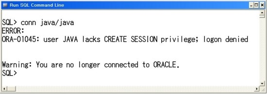

SQL Query																																						2019.12.18

---

# 1. login

계정을 생성하거나 권한을 부여하는 모든 작업은 관리자 계정에서 작업해야 합니다. 관리자 계정은 기본으로 system계정이며 패스워드는 오라클을 설치할때 지정한 패스워드로 셋팅합니다. 우리는 manager로 패스워드를 지정하였으므로 다음과 같이 관리자 계정으로 접속합니다.SQL> conn system/manager **1. 계정 생성하기**  SQL> create user java identified by java **2. 접속하기**  SQL> conn java/java  =>  계정을 생성한 후 바로 접속하면 접속권한을 부여하지 않았기 때문에 다음과 같이 에러메시지      가 나타납니다.     **3. 권한 부여하기**   접속할 수 있는 권한과 여러 가지 다양한 권한을 주어야 하는데 여러번    권한 주는 것이 번거로우므로 여러개의 권한을 하나로 묶어 놓은 롤을     지정하여 작업합니다.   이때 주의하실 부분은 conn java/java를 이용하여 접속하려다 실패한    경우 system계정에 접속한 상태에서 벗어나므로 다시 관리자 계정으로     접속해야 합니다.      SQL> grant connect,resource to java      접속하면 접속이 가능한 것을 확인할 수 있습니다. **4. 계정 비밀번호 변경하기**   계정의 패스워드를 java123으로 변경해 보도록 하겠습니다.   이미 작성된 사용자의 정보를 변경하는 것이므로 alter user문을 이용하    여 작업합니다.   SQL>alter user java identified by java123  **5. 계정 lock풀기**   샘플 계정인 hr계정의 lock을 풀어야 합니다.      SQL>alter user hr account unlock;   위와 같이 입력하시면 계정의 패스워드를 다시 입력하라는 메시지가 나    타납니다. 암호이므로 입력 했을때 화면에 아무것도 표시되지 않을 것    입니다. 다음과 같이 암호와 암호확인을 두 번 입력하면 암호가 재지정    되며 접속했다는 메시지가 나타납니다.    


```mysql
SQL> conn system/system
ERROR:
ORA-01017: invalid username/password; logon denied


SQL> conn system/manager
Connected.
SQL> alter user hr account unlock;

User altered.

SQL> conn hr/hr
ERROR:
ORA-01017: invalid username/password; logon denied


Warning: You are no longer connected to ORACLE.
SQL> conn system/manager
Connected.
SQL> alter user hr account unlock;

User altered.

SQL> select user from dual
  2  ;

USER
------------------------------------------------------------
SYSTEM

SQL> alter user hr identified by hr;

User altered.

SQL> conn hr/hr;
Connected.
```


# 2. SQL

* DDL (Data Definition Language)

  : 데이터 정의어 .

  - create, drop, alter

* DML (Data Manipulation Language)

  - select : 테이블에서 행 검색
  - insert : 테이블에 신규 행 등록
  - delete : 테이블에 행 삭제

* DCL (Data Control Language)

  - commit : 데이터베이스 변경 내용 확정
  - rollback : 데이터베이스 변경 내용 취소
  - grant : 사용자에게 처리 권한 부여
  - revoke : 사용자 처리 권한을 제거

* Query


#  3.  Query 


## 1) 기본 select

```sql
select 컬럼명1, 컬럼2...

	from 테이블
```


 - sql문은 대소문자 구분하지 않는다.

 - ;은 sql문의 종료를 의미

   ;을 입력하기 전에 여러줄로 sql문을 작성할 수 있다.

- *는 모든 컬럼을 조회하겠다는 의미

- 컬럼에 null을 저장할 수 있다.

  null은 0이나 space만 입력해 놓은 값과 다른 값

  null : 아무 값도 없는 것을 의미(empty)

  사용할 수 없고 저장되어 있지 않은 상태


```mysql
select empno, ename, hiredate, job
from emp;
```


* 컬럼명 대신 alias를 정의해서 사용할 수 있다.

  ```mysql
  select 컬럼명 alias명, 컬럼명 as alias명, 컬럼명 "alias명"
  ```

  * 컬럼명 "alias명"

 	: alias명에 공백이 있는 경우 사용


ex)

```mysql
select ename 사원명, hiredate as 입사일, sal "월 급여"
from emp;

result-----------------------------------------------------------

사원명               입사일      월 급여
-------------------- -------- ----------
SMITH                80/12/17        800
ALLEN                81/02/20       1600
WARD                 81/02/22       1250
JONES                81/04/02       2975
MARTIN               81/09/28       1250
BLAKE                81/05/01       2850
CLARK                81/06/09       2450
SCOTT                82/12/09       3000
KING                 81/11/17       5000
TURNER               81/09/08       1500
ADAMS                83/01/12       1100

사원명               입사일      월 급여
-------------------- -------- ----------
JAMES                81/12/03        950
FORD                 81/12/03       3000
MILLER               82/01/23       1300

14 rows selected.
```


* 여러 컬럼을 합쳐서 하나의 컬럼으로 조회할 수 있다.

  → ||연산자 이용 (sout에서의 '+'처럼 사용)

  ```mysql
  select '나의 입사일은' || hiredate || '입니다.'
  from emp;
  
  result----------------------------------------------------------------
  
  '나의입사일은'||HIREDATE||'입니다.'
  -----------------------------------
  나의 입사일은80/12/17입니다.
  나의 입사일은81/02/20입니다.
  나의 입사일은81/02/22입니다.
  나의 입사일은81/04/02입니다.
  나의 입사일은81/09/28입니다.
  나의 입사일은81/05/01입니다.
  나의 입사일은81/06/09입니다.
  나의 입사일은82/12/09입니다.
  나의 입사일은81/11/17입니다.
  나의 입사일은81/09/08입니다.
  나의 입사일은83/01/12입니다.
  
  '나의입사일은'||HIREDATE||'입니다.'
  -----------------------------------
  나의 입사일은81/12/03입니다.
  나의 입사일은81/12/03입니다.
  나의 입사일은82/01/23입니다.
  
  14 rows selected.
  ```

  

* 오라클의 문자열, 날짜 데이터는 ' '로 표현

  

* 연산의 결과로 컬럼을 생성할 수 있다.  (+, *, /, -, 함수...)

  → 원본에 저장되지는 않는다.

  단, null이 포함되어있는 컬럼은 연산할 수 없다.

  ```mysql
  select ename, sal, comm, sal+comm 급여합
  from emp;
  
  result==============================================
  
  ENAME                       SAL       COMM     급여합
  -------------------- ---------- ---------- ----------
  SMITH                       800
  ALLEN                      1600        300       1900
  WARD                       1250        500       1750
  JONES                      2975
  MARTIN                     1250       1400       2650
  BLAKE                      2850
  CLARK                      2450
  SCOTT                      3000
  KING                       5000
  TURNER                     1500          0       1500
  ADAMS                      1100
  
  ENAME                       SAL       COMM     급여합
  -------------------- ---------- ---------- ----------
  JAMES                       950
  FORD                       3000
  MILLER                     1300
  
  14 rows selected.
  ```

  

* 중복이 있는 경우 중복을 제거하기 위해 select문에 distinct를 추가할 수 있다. 

  ```mysql
  select distinct job from emp;
  
  result-------------------------------
  
  JOB
  -----------
  CLERK
  SALESMAN
  PRESIDENT
  MANAGER
  ANALYST
  
  ref====================================
  
  select job from emp;
  
  result---------------------------------
  
  JOB
  --------------
  CLERK
  SALESMAN
  SALESMAN
  MANAGER
  SALESMAN
  MANAGER
  MANAGER
  ANALYST
  PRESIDENT
  SALESMAN
  CLERK
  
  JOB
  --------------
  CLERK
  ANALYST
  CLERK
  
  ```


## 2) select절에 조건 추가하기

> select	[distinct]	컬럼명,	컬럼명,	.... [alias명]
>
> from	테이블명
>
> where 조건

* 검색 결과를 제한 (조건에 만족하는 데이터만 조회하겠다는 의미)

* where절은 from절 다음에 정의

* where절은 조건식이 true가 되도록 정의

* where절에 사용할 수 있는 비교연산자

  \>, >=, <, <=, =(같다), <>(같지않다), != (같지않다)

  ```mysql
  select ename, job, hiredate, sal
  from emp
  where sal>3000;
  
  result-----------------------------------------------
  
  ENAME                JOB                HIREDATE        SAL
  -------------------- ------------------ -------- ----------
  KING                 PRESIDENT          81/11/17       5000
  ```


* where절에서 조건과 함께 비교하는 값을 추가해야 하는 경우 문자, 날짜는 작은 따옴표로 묶어줘야 한다.


* SQL은 대소문자를 구분하지 않지만, 값을 비교하는 경우 정확하게 대소문자까지 일치해야 한다.

  ```mysql
  select ename, job, hiredate, sal
  from emp
  where job = 'CLERK';
  
  result----------------------------------
  
  ENAME                JOB                HIREDATE        SAL
  -------------------- ------------------ -------- ----------
  SMITH                CLERK              80/12/17        800
  ADAMS                CLERK              83/01/12       1100
  JAMES                CLERK              81/12/03        950
  MILLER               CLERK              82/01/23       1300
  
  compare=================================
  
  select ename, job, hiredate, sal
  from emp
  where job = 'clerk';
  
  result----------------------------------
  
  no rows selected
  ```


* 날짜도 연산 가능하다.

  ```mysql
  select ename, job, hiredate, sal
  from emp
  where hiredate> '1982/01/01';
  
  result----------------------------------------------------
  
  ENAME                JOB                HIREDATE        SAL
  -------------------- ------------------ -------- ----------
  SCOTT                ANALYST            82/12/09       3000
  ADAMS                CLERK              83/01/12       1100
  MILLER               CLERK              82/01/23       1300
  ```

  

  

* 두 개 이상의 조건이 있는 경우 사용할 수 있는 연산자

  * and 연산자 : 모든 조건이 일치

```mysql
select *
from emp
where deptno = 10
	  and job = 'MANAGER';
  
result-------------------------------------------------------------------------------
  
EMPNO  ENAME   JOB              MGR       HIREDATE      SAL       COMM     DEPTNO
------ ------- --------------- -------    ------------- --------- -------- ----------
7782   CLARK           MANAGER   7839      81/06/09       2450                   10
```

  

  * or 연산자 : 조건 중 한 개만 일치

```mysql
select ename, job, deptno, sal
from emp
where deptno = 10
or sal>=2000;

result-------------------------------------------------------

ENAME                JOB                    DEPTNO        SAL
-------------------- ------------------ ---------- ----------
JONES                MANAGER                    20       2975
BLAKE                MANAGER                    30       2850
CLARK                MANAGER                    10       2450
SCOTT                ANALYST                    20       3000
KING                 PRESIDENT                  10       5000
FORD                 ANALYST                    20       3000
MILLER               CLERK                      10       1300
```


  * in 연산자 : or연산자의 의미와 동일

    ​				  컬럼명 in (비교할 값, 값, ........)

    ```
    
    ```

    

  * not 연산자 : 부정


* null값에 대한 비교

  * is null:

    ```mysql
    select ename, sal, comm
    from emp
    where comm is null;
    
    result-----------------------------------
    
    ENAME                       SAL       COMM
    -------------------- ---------- ----------
    SMITH                       800
    JONES                      2975
    BLAKE                      2850
    CLARK                      2450
    SCOTT                      3000
    KING                       5000
    ADAMS                      1100
    JAMES                       950
    FORD                       3000
    MILLER                     1300
    ```

    

  * is not null:

    ```mysql
    select ename, sal, comm
    from emp
    where comm is not null;
    
    result --------------------------------
    
    ENAME                       SAL       COMM
    -------------------- ---------- ----------
    ALLEN                      1600        300
    WARD                       1250        500
    MARTIN                     1250       1400
    TURNER                     1500          0
    ```

    


* like 연산자 : 대표문자와 함께 사용. 조건 비교를 위해 입력한 값이 문자열에 포함되어 있는 것을 찾는 경우.

  * %: 모든 문자열

    * 컬럼명 like 값%

      ```mysql
      # 값%
      select ename, sal, comm
      from emp
      where ename like 'A%';
      
      result --------------------------------
      
      ENAME                       SAL       COMM
      -------------------- ---------- ----------
      ALLEN                      1600        300
      ADAMS                      1100
      ```

      

    * 컬럼명 like %값

    * 컬럼명 like %값%

      ```mysql
      select ename, sal, comm
      from emp
      where ename like '%A%';
      
      result-------------------
      
      ENAME                       SAL       COMM
      -------------------- ---------- ----------
      ALLEN                      1600        300
      WARD                       1250        500
      MARTIN                     1250       1400
      BLAKE                      2850
      CLARK                      2450
      ADAMS                      1100
      JAMES                       950
      ```

      

      

      

  * _ : 한 자리 문자를 의미

    ```mysql
    select ename, sal, comm
    from emp
    where ename like '_A%';
    
    result--------------------------
    
    ENAME                       SAL       COMM
    -------------------- ---------- ----------
    WARD                       1250        500
    MARTIN                     1250       1400
    JAMES                       950
    ```

    


* between 연산자

  ```mysql
  select ename, sal
  from emp
  where sal between 2000 and 5000;
  
  result---------------------------
  
  ENAME                       SAL
  -------------------- ----------
  JONES                      2975
  BLAKE                      2850
  CLARK                      2450
  SCOTT                      3000
  KING                       5000
  FORD                       3000
  
  6 rows selected.
  
  ```

  

## 3) 데이터 정렬

> select [distinct] 컬럼명, 컬럼명, .........[alias명]
>
> from 테이블명
>
> where 조건
>
> order by 컬럼명 정렬기준 (asc, desc)

> 생략시 오름차순


* 기본(asc)

  ```mysql
  SQL> select ename, sal, job
    2  from emp
    3  order by sal;
  
  result-------------------------------------------
  
  ENAME                       SAL JOB
  -------------------- ---------- ------------------
  SMITH                       800 CLERK
  JAMES                       950 CLERK
  ADAMS                      1100 CLERK
  WARD                       1250 SALESMAN
  MARTIN                     1250 SALESMAN
  MILLER                     1300 CLERK
  TURNER                     1500 SALESMAN
  ALLEN                      1600 SALESMAN
  CLARK                      2450 MANAGER
  BLAKE                      2850 MANAGER
  JONES                      2975 MANAGER
  
  ENAME                       SAL JOB
  -------------------- ---------- ------------------
  SCOTT                      3000 ANALYST
  FORD                       3000 ANALYST
  KING                       5000 PRESIDENT
  ```

  

* 오름차순 (asc)

  ```mysql
  SQL> select ename, sal, job
    2  from emp
    3  order by job asc;
  
  ENAME                       SAL JOB
  -------------------- ---------- --------------
  SCOTT                      3000 ANALYST
  FORD                       3000 ANALYST
  MILLER                     1300 CLERK
  JAMES                       950 CLERK
  SMITH                       800 CLERK
  ADAMS                      1100 CLERK
  BLAKE                      2850 MANAGER
  JONES                      2975 MANAGER
  CLARK                      2450 MANAGER
  KING                       5000 PRESIDENT
  TURNER                     1500 SALESMAN
  
  ENAME                       SAL JOB
  -------------------- ---------- --------------
  MARTIN                     1250 SALESMAN
  WARD                       1250 SALESMAN
  ALLEN                      1600 SALESMAN
  
  14 rows selected.
  ```

  

* 내림차순 (desc)

  ```mysql
  SQL> select ename, sal, job
    2  from emp
    3  order by sal desc;
  
  ENAME                       SAL JOB
  -------------------- ---------- ------------------
  KING                       5000 PRESIDENT
  FORD                       3000 ANALYST
  SCOTT                      3000 ANALYST
  JONES                      2975 MANAGER
  BLAKE                      2850 MANAGER
  CLARK                      2450 MANAGER
  ALLEN                      1600 SALESMAN
  TURNER                     1500 SALESMAN
  MILLER                     1300 CLERK
  WARD                       1250 SALESMAN
  MARTIN                     1250 SALESMAN
  
  ENAME                       SAL JOB
  -------------------- ---------- ------------------
  ADAMS                      1100 CLERK
  JAMES                       950 CLERK
  SMITH                       800 CLERK
  
  14 rows selected.
  ```

  

* 다중 정렬 기준

  : 2개 이상의 정렬 기준을 줄 수 있다.

  ```mysql
  SQL> select ename, job, hiredate
    2  from emp
    3  where deptno in (10,20,30)
    4  order by job desc,ename asc;
  
  ENAME                JOB                HIREDATE
  -------------------- ------------------ --------
  ALLEN                SALESMAN           81/02/20
  MARTIN               SALESMAN           81/09/28
  TURNER               SALESMAN           81/09/08
  WARD                 SALESMAN           81/02/22
  KING                 PRESIDENT          81/11/17
  BLAKE                MANAGER            81/05/01
  CLARK                MANAGER            81/06/09
  JONES                MANAGER            81/04/02
  ADAMS                CLERK              83/01/12
  JAMES                CLERK              81/12/03
  MILLER               CLERK              82/01/23
  
  ENAME                JOB                HIREDATE
  -------------------- ------------------ --------
  SMITH                CLERK              80/12/17
  FORD                 ANALYST            81/12/03
  SCOTT                ANALYST            82/12/09
  
  14 rows selected.
  
  ```

  

+) null값은 오름차순으로 정렬했을때 제일 마지막에 배치된다.


## 4) 함수

> 함수의 종류는 단일행 함수, 그룹함수가 있다.
>
> 단일행 함수를 저장하면 테이블의 모든 행에 각각 함수가 적용된다.
>
> 그룹함수는 그룹으로 묶인 데이터에 적용되므로 where절에서 사용될 수 없다.
>
> 단일행 함수 (문자, 숫자, 날짜, 변환, null, ...)
>
> 그룹 함수 (SUM, AVG, COUNT, MAX, ...)


* 단일행 함수

  : select, where, order by 절에 모두 사용할 수 있다.

  * 산술함수

    

  * 문자열함수

    * 연결연산자(||) : string 연결. java의 +와 같은 역할
    * lower(문자열 or 컬럼명) : 값을 소문자로 변환
    * upper(문자열 or 컬럼명) : 값을 대문자로 변환
    * initcap(문자열 or 컬럼명) : 전달된 값의 첫 글자만 대문자로 변환

    ```mysql
    SQL> select lower('TEST'), UPPER('test'), initcap('test')
      2  from dual;
    
    LOWER('T UPPER('T INITCAP(
    -------- -------- --------
    test     TEST     Test
    ```

    

    * substr(문자열 or 컬럼명, 시작 위치, 문자열의 갯수) : 시작위치부터 갯수까지 문자열 자르기

      *** 오라클에서 인덱스는 1부터 시작

      ```mysql
      SQL> select substr('oracle', 2)
        2  from dual;
      
      SUBSTR('OR'
      ----------
      racle
      
      SQL> select substr('oracle', 2, 2) from dual;
      
      SUBS
      ----
      ra
      ```

      

      * length(문자열) : 문자열의 길이 return

      ```mysql
      SQL> select length('oracle')
        2  from dual;
      
      LENGTH('ORACLE')
      ----------------
                     6
      ```

      

      

      * instr(문자열 or 컬럼명, 찾을 문자, 찾을 위치, n번째 문자) 

        :  특정 칼럼이나 문자열에서 문자의 위치를 찾을 때 사용한 함수.

        ​	제일 처음 찾은 위치를 반환.

        ​	찾을 위치나 n번째 문자에 대한 매개변수는 생략이 가능.

        ​	찾을 위치를 -1로 정의하면 문자열의 오른쪽 끝에서 문자를 찾는다.

      ```mysql
      -- instr(str, str)
      SQL> select instr('oracle oracle oracle', 'a') from dual;
      
      INSTR('ORACLEORACLEORACLE','A')
      -------------------------------
                                    3
                                    
      -- instr(str, str, int) // 해당 문자열의 5번 위치부터 찾기
      SQL> select instr('oracle oracle oracle', 'a', 5) from dual
        2  ;
      
      INSTR('ORACLEORACLEORACLE','A',5)
      ---------------------------------
                                     10
                                     
                                     
      -- instr(str, str, int, int) // 해당 문자열의 5번 위치부터 2번째 'a' 찾아 위치 반환
      SQL> select instr('oracle oracle oracle', 'a', 5, 2) from dual;
      
      INSTR('ORACLEORACLEORACLE','A',5,2)
      -----------------------------------
                                       17
                                       
                                       
      -- instr(str, str, -1, int) // 뒤에서부터 탐색
      SQL> select instr('oracle oracle oracle', 'a', -1, 2) from dual;
      
      INSTR('ORACLEORACLEORACLE','A',-1,2)
      ------------------------------------
                                        10
      ```

      

      * concat(문자열 or 컬럼명, 문자열 or 컬럼명) :  ||연산자와 동일. 문자열 연결

      ```mysql
      SQL> select concat('oracle', 'dbms') from dual;
      
      CONCAT('ORACLE','DBMS'
      ----------------------
      oracledbms
      ```

      

      * lpad(문자열 or 컬럼명, 출력할 문자열의 길이, 출력할 문자) 

        : 전체 출력할 문자열의 길이 문자열을 출력한 후 남는 공간에 정의한 문자를 채워 출력해주는 함수 (왼쪽)  ↔ rpad (오른쪽)

      ```mysql
      -- lpad
      SQL> select lpad('oracle', 10, '*')
        2  from dual;
      
      LPAD('ORACLE',10,'*'
      --------------------
      ****oracle
      
      -- rpad
      SQL> select rpad('oracle', 10, '*')
        2  from dual;
      
      RPAD('ORACLE',10,'*')
      --------------------
      oracle****
      ```

      

    * ltrim(문자열 or 컬럼명, 제거할 문자) 

      : 컬럼에서 매개변수로 정의한 문자를 왼쪽에서 찾아 모두 제거 ↔ rtrim (오른쪽)

        주로 데이터 전송시 데이터 공백을 제거할 때 사용 

      \+ trim(제거할 문자 from 문자열 or 컬럼명)

    ```mysql
    -- ltrim
    SQL> select ltrim('aaaaaaorcle', 'a') from dual;
    
    LTRIM('AAA
    ----------
    orcle
    
          
    -- rtrim (왼쪽은 지워지지 않음)
    SQL> select rtrim('aaaaaaorcle', 'a') from dual
      2  ;
    
    RTRIM('AAAAAAORCLE','A
    ----------------------
    aaaaaaorcle
    
          
    -- rtrim
    SQL> select ltrim('orcleaaaa', 'a') from dual;
    
    LTRIM('ORCLEAAAA',
    ------------------
    orcleaaaa
          
          
    -- 공백 제거
    SQL>  select ltrim('            orcle', ' ') from dual;
    
    LTRIM('ORC'
    ----------
    orcle
          
     
    -- trim(제거할 문자 from 문자열 or 컬럼명) 앞 뒤만 지워짐
    SQL> select trim('*' from '**dd***d8***')
    2  from dual;
    
    TRIM('*'FROM'*'
    --------------
    dd***d8
    
    ```

    

  * 숫자함수

    * round(숫자, 반올림할 위치/ 소숫점자리수(양수) or n의 자리수(음수))

      : 반올림

    ```mysql
    -- 
    SQL> select round(125.8888,0)
      2  from dual;
    
    ROUND(125.8888,0)
    -----------------
                  126
    
    -- 
    SQL> select round(125.8888,1)
      2  from dual;
    
    ROUND(125.8888,1)
    -----------------
                125.9
    
    -- 
    SQL> select round(125.8888,-1)
      2  from dual;
    
    ROUND(125.8888,-1)
    ------------------
                   130
    ```

    

  * 변환함수

    * 데이터의 타입을 변환하기 위한 함수
    * 또 다른 함수의 매개변수로 사용하게 될 경우 타입이 컬럼의 타입과 일치해야하므로 타입 변환 

    * cast(값 or 컬럼명 as 타입:날짜(data), 숫자(integer))

    * to_char(변환할 데이터, 표시할 format)

      * 숫자를 문자로 변환

        : 숫자의 한 자리를 표시 → 9, 0

          콤마 → ,

          소수점 → .

        통화기호 → \, $, L(지역의 통화기호를 출력)

        

      * 날짜를 문자열로 변환

        : 년 월 일 각각의 데이터를 추출하고 싶은 경우 

          연도 → YYYY (2019)

          월 → MM (12)

          일 → DD (19)

      ```mysql
      SQL> select cast('2019/11/11' as date)
        2  from dual;
      
      CAST('20'
      --------
      19/11/11
      
      SQL> select cast('0001' as integer)
        2  from dual;
      
      CAST('0001'ASINTEGER)
      ---------------------
                          1
      
      SQL> select cast('2019년 11월 11일' as date) from dual
      select cast('2019년 11월 11일' as date) from dual
                  *
      ERROR at line 1:
      ORA-01861: literal does not match format string
      ```

      ```mysql
      SQL> select ename, sal, to_char(sal, '9,999')
        2  from emp;
      
      ENAME                       SAL TO_CHAR(SAL,
      -------------------- ---------- ------------
      SMITH                       800    800
      ALLEN                      1600  1,600
      WARD                       1250  1,250
      JONES                      2975  2,975
      MARTIN                     1250  1,250
      BLAKE                      2850  2,850
      CLARK                      2450  2,450
      SCOTT                      3000  3,000
      KING                       5000  5,000
      TURNER                     1500  1,500
      ADAMS                      1100  1,100
      
      ENAME                       SAL TO_CHAR(SAL,
      -------------------- ---------- ------------
      JAMES                       950    950
      FORD                       3000  3,000
      MILLER                     1300  1,300
      
      14 rows selected.
                                      
                                              
      -- $                                  
      SQL> select ename, sal, to_char(sal, '$9,999')
        2  from emp;
      
      ENAME                       SAL TO_CHAR(SAL,
      -------------------- ---------- --------------
      SMITH                       800    $800
      ALLEN                      1600  $1,600
      WARD                       1250  $1,250
      JONES                      2975  $2,975
      MARTIN                     1250  $1,250
      BLAKE                      2850  $2,850
      CLARK                      2450  $2,450
      SCOTT                      3000  $3,000
      KING                       5000  $5,000
      TURNER                     1500  $1,500
      ADAMS                      1100  $1,100
      
      ENAME                       SAL TO_CHAR(SAL,
      -------------------- ---------- --------------
      JAMES                       950    $950
      FORD                       3000  $3,000
      MILLER                     1300  $1,300
      
      14 rows selected.
      
                                              
                                              
      -- L:local                          
      SQL> select ename, sal, to_char(sal, 'L9,999')
        2  from emp;
      
      ENAME                       SAL TO_CHAR(SAL,'L9,999')
      -------------------- ---------- --------------------------------
      SMITH                       800           ￦800
      ALLEN                      1600         ￦1,600
      WARD                       1250         ￦1,250
      JONES                      2975         ￦2,975
      MARTIN                     1250         ￦1,250
      BLAKE                      2850         ￦2,850
      CLARK                      2450         ￦2,450
      SCOTT                      3000         ￦3,000
      KING                       5000         ￦5,000
      TURNER                     1500         ￦1,500
      ADAMS                      1100         ￦1,100
      
      ENAME                       SAL TO_CHAR(SAL,'L9,999')
      -------------------- ---------- --------------------------------
      JAMES                       950           ￦950
      FORD                       3000         ￦3,000
      MILLER                     1300         ￦1,300
      
      14 rows selected.  
                    
      -- 연도만 출력                       
                                              
      SQL> select ename, hiredate, to_char(hiredate, 'YYYY'
        2  from emp
        3  ;
      
      ENAME                HIREDATE TO_CHAR(
      -------------------- -------- --------
      SMITH                80/12/17 1980
      ALLEN                81/02/20 1981
      WARD                 81/02/22 1981
      JONES                81/04/02 1981
      MARTIN               81/09/28 1981
      BLAKE                81/05/01 1981
      CLARK                81/06/09 1981
      SCOTT                82/12/09 1982
      KING                 81/11/17 1981
      TURNER               81/09/08 1981
      ADAMS                83/01/12 1983
      
      ENAME                HIREDATE TO_CHAR(
      -------------------- -------- --------
      JAMES                81/12/03 1981
      FORD                 81/12/03 1981
      MILLER               82/01/23 1982
      
      14 rows selected.
          
          
      -- 월만 뽑아서 월별로 정렬
      SQL> select ename, to_char(hiredate, 'mon') 월
        2  from emp
        3  order by to_char(hiredate,'MM');
      
      ENAME                월
      -------------------- ----------------
      ADAMS                1월
      MILLER               1월
      ALLEN                2월
      WARD                 2월
      JONES                4월
      BLAKE                5월
      CLARK                6월
      TURNER               9월
      MARTIN               9월
      KING                 11월
      SCOTT                12월
      
      ENAME                월
      -------------------- ----------------
      SMITH                12월
      JAMES                12월
      FORD                 12월
      
      14 rows selected.
          
      ```

      

  * 날짜함수

    : sysdate - 오늘날짜

    ```mysql
    SQL> select sysdate from dual;
    
    SYSDATE
    --------
    19/12/19
    ```

    날짜데이터는 연산이 가능하다.

    ```mysql
    SQL> select sysdate-5, sysdate, sysdate+5 from dual;
    
    SYSDATE- SYSDATE  SYSDATE+
    -------- -------- --------
    19/12/14 19/12/19 19/12/24
    ```

    

      

  * null처리함수

    * nvl(컬럼, null인 경우 처리할 식이나 값) - null 인 경우 대신할 식이나 값을 명시

    * nvl2(컬럼, 표현값1, 표현값2)

      표현값1 : null이 아닌경우

      표현값2 : null인 경우

      ```mysql
      -- null인 부분에 0
      SQL> select ename, sal,nvl(comm,0) from emp;
      
      ENAME                       SAL NVL(COMM,0)
      -------------------- ---------- -----------
      SMITH                       800           0
      ALLEN                      1600         300
      WARD                       1250         500
      JONES                      2975           0
      MARTIN                     1250        1400
      BLAKE                      2850           0
      CLARK                      2450           0
      SCOTT                      3000           0
      KING                       5000           0
      TURNER                     1500           0
      ADAMS                      1100           0
      
      ENAME                       SAL NVL(COMM,0)
      -------------------- ---------- -----------
      JAMES                       950           0
      FORD                       3000           0
      MILLER                     1300           0
      
      14 rows selected.
      
      SQL> select ename, sal,nvl(comm,'no commition') from emp;
      select ename, sal,nvl(comm,'no commition') from emp
                                 *
      ERROR at line 1:
      ORA-01722: invalid number
      
      
      SQL> select ename, sal,nvl(comm,'empty') from emp;
      select ename, sal,nvl(comm,'empty') from emp
                                 *
      ERROR at line 1:
      ORA-01722: invalid number
      
      
      SQL> select ename, sal,nvl(to_char(comm),'empty') from emp;
      
      ENAME                       SAL NVL(TO_CHAR(COMM),'EMPTY')
      -------------------- ---------- ----------------------------------
      SMITH                       800 empty
      ALLEN                      1600 300
      WARD                       1250 500
      JONES                      2975 empty
      MARTIN                     1250 1400
      BLAKE                      2850 empty
      CLARK                      2450 empty
      SCOTT                      3000 empty
      KING                       5000 empty
      TURNER                     1500 0
      ADAMS                      1100 empty
      
      ENAME                       SAL NVL(TO_CHAR(COMM),'EMPTY')
      -------------------- ---------- ----------------------------------
      JAMES                       950 empty
      FORD                       3000 empty
      MILLER                     1300 empty
      
      14 rows selected.
      
      -- null 이 아니면 영업부 null이면 타부서
      SQL> select ename, sal,nvl2(to_char(comm),'영업부','타부서') from emp;
      
      ENAME                       SAL NVL2(TO_CHAR(COMM)
      -------------------- ---------- ------------------
      SMITH                       800 타부서
      ALLEN                      1600 영업부
      WARD                       1250 영업부
      JONES                      2975 타부서
      MARTIN                     1250 영업부
      BLAKE                      2850 타부서
      CLARK                      2450 타부서
      SCOTT                      3000 타부서
      KING                       5000 타부서
      TURNER                     1500 영업부
      ADAMS                      1100 타부서
      
      ENAME                       SAL NVL2(TO_CHAR(COMM)
      -------------------- ---------- ------------------
      JAMES                       950 타부서
      FORD                       3000 타부서
      MILLER                     1300 타부서
      
      14 rows selected.
      ```

      

      * 언어 session 변경

      ```mysql
      SQL> alter session set nls_language = 'american';
      
      Session altered.
      
      SQL> select ename, to_char(hiredate, 'mon') 월 from emp;
      
      ENAME                월
      -------------------- ------------------------
      SMITH                dec
      ALLEN                feb
      WARD                 feb
      JONES                apr
      MARTIN               sep
      BLAKE                may
      CLARK                jun
      SCOTT                dec
      KING                 nov
      TURNER               sep
      ADAMS                jan
      
      ENAME                월
      -------------------- ------------------------
      JAMES                dec
      FORD                 dec
      MILLER               jan
      
      14 rows selected.
      
      SQL> select ename, to_char(hiredate, 'month') 월 from emp;
      
      ENAME                월
      -------------------- ---------------------------------------
      SMITH                december
      ALLEN                february
      WARD                 february
      JONES                april
      MARTIN               september
      BLAKE                may
      CLARK                june
      SCOTT                december
      KING                 november
      TURNER               september
      ADAMS                january
      
      ENAME                월
      -------------------- ----------------------------------------
      JAMES                december
      FORD                 december
      MILLER               january
      
      14 rows selected.
      
      ```

      

      

  

* 그룹 함수

  * where절은 단일 행 단위로 검사하기 때문에

    그룹함수는 where절에서 사용할 수 없다.

    ```mysql
    SQL> select ename, sal, comm
      2  from emp
      3  where sal>=avg(sal);
    where sal>=avg(sal)
               *
    ERROR at line 3:
    ORA-00934: group function is not allowed here
    ```

    

  * 하지만 select절에서는 사용이 가능하다.

    ```mysql
    SQL> SELECT SUM(SAL), AVG(SAL), MAX(SAL), MIN(SAL), COUNT(SAL)
      2  FROM EMP
      3  WHERE DEPTNO=10;
    
      SUM(SAL)   AVG(SAL)   MAX(SAL)   MIN(SAL) COUNT(SAL)
    ---------- ---------- ---------- ---------- ----------
          8750 2916.66667       5000       1300          3
    ```

    

  * count(FK)

  

  
## 5) 그룹화

  * 기본형

    select [컬럼..]

    from [테이블..]

    where [조건]

    group by [그룹화할 컬럼명 (함수를 포함한 식도 가능)]

    having [group by한 결과에 적용할 조건]

    order by [정렬할 컬럼명]

    

    * 테이블에 저장된 레코드를 그룹화하여 분류하고 싶은 경우 사용
    * select절에는 group by 절에 명시한 컬럼명과 그룹함수만 사용할 수 있다.

    ```mysql
    SQL> select count(empno)  from emp where deptno = 20;
    
    COUNT(EMPNO)
    ------------
               5
    
    -- count한 항목인 deptno까지 select
    SQL> select deptno,count(empno)  from emp group by deptno;
    
        DEPTNO COUNT(EMPNO)
    ---------- ------------
            30            6
            20            5
            10            3
    
    ```

    

    * 그룹화한 항목만 select 가능

    ```mysql
    SQL> select deptno, job, count(empno)
      2  from emp
      3  group by deptno;
    select deptno, job, count(empno)
                   *
    ERROR at line 1:
    ORA-00979: not a GROUP BY expression
    ```

    

    * 예제) 직업별 연봉 평균

    ```mysql
    SQL> select job,avg(sal) from emp group by job;
    
    JOB                  AVG(SAL)
    ------------------ ----------
    CLERK                  1037.5
    SALESMAN                 1400
    PRESIDENT                5000
    MANAGER            2758.33333
    ANALYST                  3000
    ```

    

    * 데이터가 복잡한 경우 group by 절에 2개 이상의 컬럼을 명시할 수 있다.

    ```mysql
    SQL> select deptno, job, count(empno)
      2  from emp
      3  group by deptno, job;
    
        DEPTNO JOB                COUNT(EMPNO)
    ---------- ------------------ ------------
            20 CLERK                         2
            30 SALESMAN                      4
            20 MANAGER                       1
            30 CLERK                         1
            10 PRESIDENT                     1
            30 MANAGER                       1
            10 CLERK                         1
            10 MANAGER                       1
            20 ANALYST                       2
    
    9 rows selected.
    
    
    -- 
    SQL> select deptno, job, count(empno)
      2  from emp
      3  group by deptno, job
      4  order by deptno;
    
        DEPTNO JOB                COUNT(EMPNO)
    ---------- ------------------ ------------
            10 CLERK                         1
            10 MANAGER                       1
            10 PRESIDENT                     1
            20 ANALYST                       2
            20 CLERK                         2
            20 MANAGER                       1
            30 CLERK                         1
            30 MANAGER                       1
            30 SALESMAN                      4
    
    9 rows selected.
    ```

    

    #### 실습 예제1

    

    

    * group by 하기 전에 적용해야 하는 조건은 where절에 정의
    * group by 한 결과에 조건을 적용해야 하는 경우 having 절을 이용

    

    

    

    #### 실습 예제 3

    직업별 인원수 구하기

    단, 1983년 입사자는 제외

    최종 결과 : 인원수가 3명 이상인 직업만 출력

  ```mysql

  ```


SQL> create table test(
  2     num1 number,
  3     num2 number(3)
  4  , num3 num(3,2),
  5  num4 num(5,2),
  6     num5 number(10,3),
  7     num6 integer);
, num3 num(3,2),
          *
ERROR at line 4:
ORA-00907: missing right parenthesis

SQL> create table test(
  2     num1 number,
  3     num2 number(3)
  4  , num3 num(3,2),
  5  num4 num(5,2),
  6     num5 number(10,3),
  7     num6 integer);
, num3 num(3,2),
          *
ERROR at line 4:
ORA-00907: missing right parenthesis

SQL> create table test(
  2     num1 number,
  3     num2 number(3),
  4     num3 number(3,2),
  5     num4 number(5,2),
  6     num5 number(10,3),
  7     num6 integer);

Table created.

SQL> insert into test values(125.88, 125.88, 125.88, 125.88, 1234.12345, 125.88)
  2  ;
insert into test values(125.88, 125.88, 125.88, 125.88, 1234.12345, 125.88)
                                        *
ERROR at line 1:
ORA-01438: value larger than specified precision allowed for this column


SQL> insert into test values(125.88, 125.88, 5.88, 125.88, 1234.12345, 125.88)
  2  ;

1 row created.

SQL> select * from test;

      NUM1       NUM2       NUM3       NUM4       NUM5       NUM6
---------- ---------- ---------- ---------- ---------- ----------
```mysql
125.88        126       5.88     125.88   1234.123        126
```


select job, count(empno) 

from emp 

where hiredate not in('83%') 

group by job 

having count(empno)>=3 

order by job;