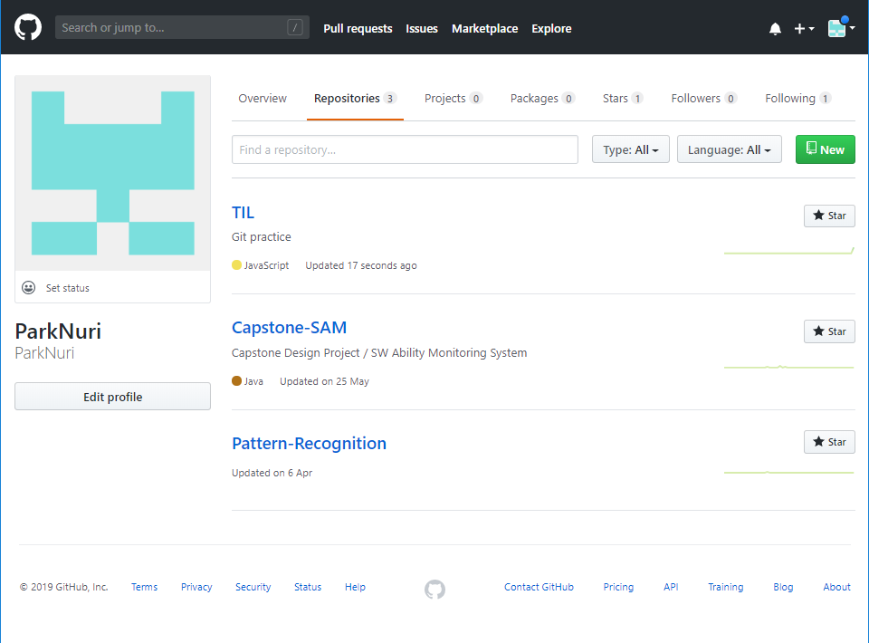
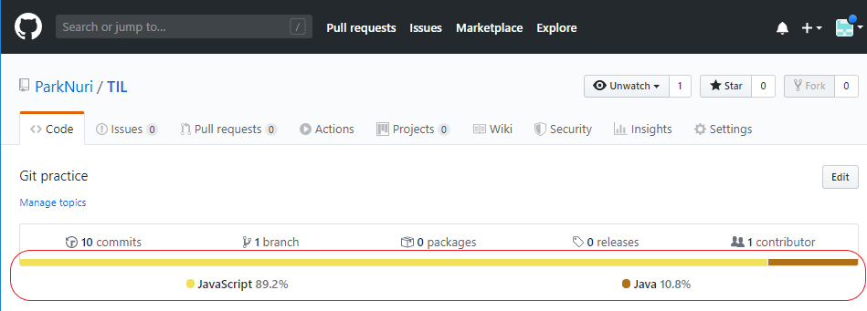
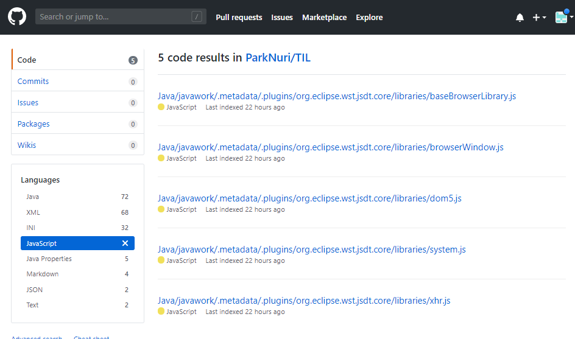
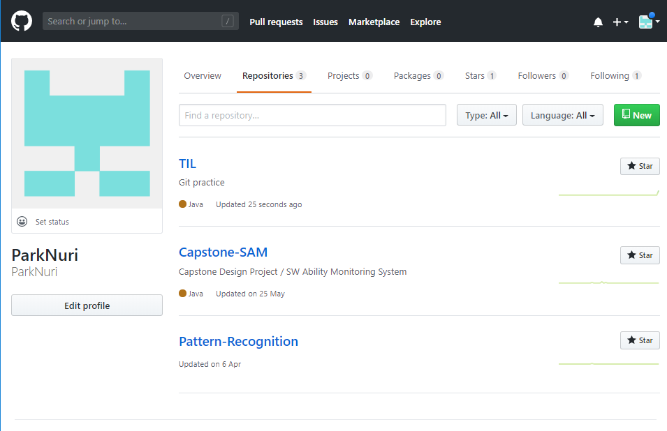

# Git

---

> Git은 분산형 버전 관리 시스템(DVCS)이다.
>
> 소스코드 형상 관리 도구로써, 작성되는 코드의 이력을 관리한다.


## 0. 기본 설정


아래의 설정은 이력 작성자(author)를 설정하는 것으로, 컴퓨터에서 최초에 한번만 설정하면 된다.

``` bash
$ git config --global user.name edutak << 본인 github 계정
$ git config --gloabl user.email e@gmail.com << 본인 이메일
github 가입 이메일로 변경
```


* 잘 되었는지 확인하는 방법

  ```bash
  $ git config --global -l
  user.name=박누리
  user.email=qkrsnrl@naver.com
  
  ```


## 1. 로컬 저장소(repository) 활용

### 1) 저장소 초기화

```bash
$ git init
Initialized empty Git repository in C:/Users/student/Desktop/TIL/.git/
(master) $
```

* `(master)`는 현재 있는 branch 위치를 뜻하며, `.git` 폴더가 생성된다.
* 해당 폴더를 삭제하게 되면 모든 `git`과 관련된 이력이 삭제된다.


### 2) add

history를 확정하기 위해서는 `add` 명령어를 통하여 `staging area` 에 `stage` 시킨다.

```bash
$ git add .					# 현재 디렉토리를 stage
$ git add README.md			# 특정 파일을 stage
$ git add images/			# 특정 이미지를 stage
```

add를 한 이후에는 항상 `status` 명령어를 통해 원하는 대로 되었는지 확인한다.

```bash
$ git status
On branch master

No commits yet

Untracked files:
  (use "git add <file>..." to include in what will be committed)
        git.md
        images/
        markdown.md

nothing added to commit but untracked files present (use "git add" to track)

```

```bash
$ git add .

```

`git add` 후 `status`

```bash
$ git status
On branch master

No commits yet

Changes to be committed:
  (use "git rm --cached <file>..." to unstage)
        new file:   git.md
        new file:   images/download.jpg
        new file:   markdown.md

```


### 3) Commit

`git`은 `commit`을 통해 이력을 남긴다.

`commit` 시에는 항상 메세지를 통해 해당 이력의 정보를 나타내야 한다.

```bash
$ git commit -m 'Init' 		<<''내에 commit 수정사항 naming 
[master (root-commit) cd5dfe0] Init; git commit -m Init
 3 files changed, 104 insertions(+)
 create mode 100644 git.md
 create mode 100644 images/download.jpg
 create mode 100644 markdown.md

```

`commit` 목록은 아래의 명령어를 통해 확인 가능하다.

```bash
$ git log
commit cd5dfe07f309ac1de3dee73fad639d02060c81de (HEAD -> master)
Author: ParkNuri <qkrsnrl@naver.com>
Date:   Thu Dec 5 16:59:56 2019 +0900

    Init;
    git commit -m Init
```

`git.md` 파일 수정 후 `git status` 시

```bash
git status
hanges not staged for commit:
  (use "git add <file>..." to update what will be committed)
  (use "git restore <file>..." to discard changes in working directory)
        modified:   git.md
```

`git staus`로 확인 후 `git add .` 

```bash
$ git add .
```

repository 생성 후 <>code 의 코드 복사 붙여넣기


## 2. 원격 저장소(remote repository) 활용

> 원격 저장소는 다양한 서비스를 통해 제공 받을 수 잇다.
>
> github, gitlab, bitbucket


### 1) 원격 저장소 등록

```bash
$ git remote add origin https~ << url
```

원격 저장소(remote)를 `origin` 이라는 이름으로 해당 url로 설정한다.

등록된 원격 저장소는 아래의 명령어로 확인할 수 있다.

등록은 한번만 실행하면 된다.

``` bash
$ git remote -v
origin https://github.com:ParkNuri/TIL.git (fetch)
origin  git@github.com:ParkNuri/TIL.git (push)

```


### 2) 원격 저장소 push

```bash
$ git push origin master
Enumerating objects: 9, done.
Counting objects: 100% (9/9), done.
Delta compression using up to 4 threads
Compressing objects: 100% (7/7), done.
Writing objects: 100% (9/9), 9.81 KiB | 3.27 MiB/s, done.
Total 9 (delta 0), reused 0 (delta 0)
To https://github.com/ParkNuri/TIL.git
 * [new branch]      master -> master

```

`origin` 원격 저장소에 `push`하게 되며, `github` 에서 확인할 수 있다.

이후 작업 과정에서는 `add`-> `commit`으로 이력을 남기고 `push`로 업로드하면 된다.


## 3. 로컬 저장소 이동

> git에 commit한 repository를 새로운 저장소에  download 하여 여러 대의 컴퓨터에서 프로젝트를 관리할 수 있다.


### 1) 로컬 저장소로 clone

```bash
git clone <repository 주소>

ex)
git clone https://github.com/ParkNuri/TIL.git
```


### 2) 로컬 저장소에 pull

로컬 저장소에서 파일을 수정한 뒤에 git에 올리기 전에 해야 할 일이 있다.

보통 repository를 팀원들과 공유하거나 다른 로컬 저장소나 원격 저장소에서 파일을 수정할 일이 생긴다.

이때 발생한 변경 사항을 현재 사용하는 로컬 저장소에 반영해야한다.


이때 변경사항이 없다면 아래와 같은 메세지가 나타날 것이다.

```bash
From https://github.com/ParkNuri/TIL
 * branch            master     -> FETCH_HEAD
Already up to date.
```


repository에 `new.txt`를 추가한 뒤 `git pull origin master`를 해보았다.

```bash
git pull origin master
remote: Enumerating objects: 4, done.
remote: Counting objects: 100% (4/4), done.
remote: Compressing objects: 100% (3/3), done.
remote: Total 3 (delta 1), reused 0 (delta 0), pack-reused 0
Unpacking objects: 100% (3/3), done.
From https://github.com/ParkNuri/TIL
 * branch            master     -> FETCH_HEAD
   78e6105..4336a5c  master     -> origin/master
Updating 78e6105..4336a5c
Fast-forward
 new.txt | 6 ++++++
 1 file changed, 6 insertions(+)
 create mode 100644 new.txt
```


위의 상황처럼 새로운 파일을 생성했을땐 충돌이 일어나지 않지만 기존 파일을 수정한 경우에는 충돌이 발생할 수 있고 충돌난 부분을 직접 수정한 다음 다시 commit을 해줘야 한다.


* Error message

  * Merge Error

    ```bash
    You have not concluded your merge (MERGE_HEAD exists)
    
    Please, commit your changes before you can merge.
    ```

    바로 직전 `pull` 시 `merge`를 시도했지만 `conflict`가 발생하여 충돌 상태일 경우 발생하는 에러

    

    solution)

    1. 직전 `pull`시 발생했던 `merge`를 취소

       ```bash
       git merge --abort
       ```

    2. 다시 pull 받기

       ```bash
       git pull origin master
       ```

    3. 변경 내용 `commit` 후 다시 `pull`

       ```bash
       git commit -m 'modified description'
       ```

       ```bash
       git pull origin master
       ```

       

       


## +) 추가 Tip

### 1) repository 주 사용 언어 변경

github가 제공하는 서비스 중 `repository language` 서비스는 repository가 담고있는 언어를 자동으로 분석하여 보여주는 기능을 제공한다. 

`linguist`라는 라이브러리가 이러한 기능을 수행하는데  repository 내의 모든 파일을 분석하기 때문에 때로는 실제로 프로젝트에 사용되는 언어가 아닌 언어가 대표 언어로 보여지기도 한다.

나같은 경우는 java 프로젝트를 관리하는 repository인데 javascript가 대표 언어로 분석되었다.

###  


이런 경우, 설정 파일 중 하나인 `.gitattributes`을 추가하여 프로젝트와 무관한 파일들을 분석 대상에서 제외할 수 있다.

`.gitattributes`는 git repository의 다양한 속성 및 설정을 정의할 수 있는 설정 파일이다.


* 분석 예외 추가

  `.gitattributes` 파일을 추가하여 `linguist` 라이브러리가 분석하지 않았으면 하는 파일이나 경로를 지정할 수 있다. 

  

  먼저  repository 에 `.gitattributes`라는 파일을 생성하고 분석에서 제외하고싶은 파일이나 경로 뒤에 `linguist-vendored` 라고  작성한다.

  ```bash
  <제외하고싶은 경로> linguist-vendored
  <제외하고싶은 파일 명> linguist-vendored
  *.<제외하고싶은 파일 형식> linguist-vendored
  
  ex) 
  *.md linguist-vendored
  java/.metadate/* linguist-vendored
  ```

  

  repository 내의 상태바 아래의 색 막대를 클릭하고 제외하고 싶은 언어를 클릭하면 해당 언어가 포함된 파일과 경로를 볼 수 있다.

  

  

  

  


* `.gitattributes` 파일 추가 후 repository 목록

  
  
  `javascript`에서 `java`로 변경됨.


## Error case 

* ssh: connect to host github.com port 22: Connection timed out

```bash
$ git push -u origin master
ssh: connect to host github.com port 22: Connection timed out
fatal: Could not read from remote repository.

Please make sure you have the correct access rights
and the repository exists.

```

**방화벽** 문제로,  git code에서 push 코드를 `ssh`가 아닌 `https`로 바꾼 후 주소를 copy하여 `push`


* 


## ETC

* 강사님 Git

  edutak


* ML/DL 강의
  * 영문

    coursero - ML/DL (Andrew Ng - 대학수업 느낌)

  * 국문

    모두를 위한 딥러닝/머신러닝

  +) kaggle.com

  주어진 데이터 분석하는 문제 사이트